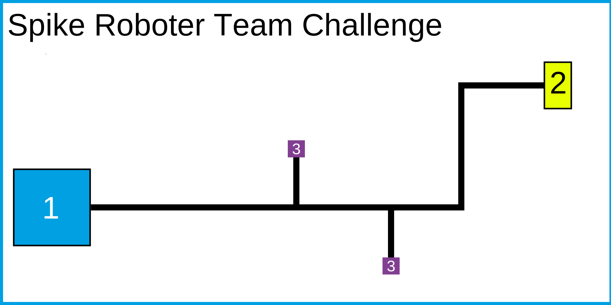

# Spike Robot Team Challenge

Im folgenden werden die Aufgaben zur Spike Robot Team Challenge beschrieben.

## Was?

Die Teams müssen einen Roboter bauen, welcher mittels Micropython programmiert wird. Der Roboter soll ein selbst gebautes Objekt in einen Zielbereich fahren. Dabei wird der Ablageort von der Jury kurz vor Start des Wertungslaufs zufällig festgelegt.

1. Das Startfeld ist cyan.
1. Das Zielfeld ist leuchtgelb.
1. Die möglichen Platzierungen für das Objekt sind violett.

## Wer?

Jedes Team hat 8-9 Teammitglieder (s. Namensschild). Die Teams strukturieren sich selbst.

## Womit?

Jedes Team bekommt [Lego Education SPIKE Prime](https://education.lego.com/de-de/products/lego-education-spike-prime-set/45678/) Set. Aus diesem Set wird der Roboter, das Zielfeld und das Objekt gebaut.

Programmiert wird in Micropython. Die SPIKE Steine sind mit [PyBricks](https://docs.pybricks.com/en/stable/) versehen.

Als IDE kann der [PyBricks Web Editor](https://code.pybricks.com/) (empfohlen), [PyCharm](https://www.jetbrains.com/de-de/pycharm/download/) oder [VS Code](https://pybricks.com/project/pybricks-other-editors/) verwendet werden.

## Wie lange?

Ihr habt 4 Stunden Zeit. In diesen 4 Stunden wird der Roboter, das Zielfeld und das Objekt gebaut und programmiert. Es finden 2 Wertungsläufe statt. 
**Am Ende muss alles wieder auseinander gebaut und wieder in den Kästen verstaut sein.**

## Bewertung

Es finden 2 Wertungsläufe statt. Nach 2:00 Stunden und nach 3:00 Stunden. Die Wertungsläufe finden in zufälliger Reihenfolge statt. 5 Min vor jedem Wertungslauf müssen die Roboter startbereit auf dem Tisch am Wertungsspielfeld liegen.

Für Schnelligkeit gibt es extra Punkte: Der schnellste Roboter erhält 10 Punkte, der zweit schnellste 5 Punkte.

_**Die Punkte des besseren Laufs zählen am Ende.**_

### Aufgabe Objekt

Das Team muss ein Objekt entwerfen und bauen, welches vom Roboter aufgenommen werden kann und in das Zielfeld passt. Der Roboter muss dieses Objekt an einem der beiden violetten Felder einsammeln und zum Zielfeld bringen. Das Objekt wird von der Jury direkt vor dem Lauf zufällig auf einem der beiden Felder platziert.

**Anforderungen Objekt:**

| Akzeptanzkriterium | Punkte |
| ------------------ | ------ |
| Objekt auf Basis konstruiert | 5 |
| Basis liegt | 5 |
| Objekt außerhalb des Feldes ohne Bodenkontakt | 5 |
| **Gesamt** | **max. 15** |

### Aufgabe Zielfeld

Jedes Team bringt zum Wertungslauf ein Zielfeld mit welches wie folgt aufgebaut ist:

Das Zielfeld wird zum Start des Wertungslauf auf dem Spielfeld im dafür vorgesehenen Feld platziert.

Das Objekt muss zum Zielfeld transportiert werden und **in** diesem abgelegt werden. Dabei darf das Zielfeld nicht verschoben werden.

| Akzeptanzkriterium | Punkte |
| ------------------ | ------ |
| Objekt vollständig im Zielfeld | 10 |
| Objekt teilweise im Zielfeld | 5 |
| Zielfeld nicht verschoben | 5 |
| **Gesamt** | **max. 15** |

### Aufgabe Parkposition

Nachdem der Roboter das Objekt abgesetzt hat, muss er zurück zur Startposition fahren und dort stehen bleiben.

| Akzeptanzkriterium | Punkte |
| ------------------ | ------ |
| Roboter vollständig im Startfeld | 10 |
| Roboter berührt das Startfeld | 5 |
| **Gesamt** | **max. 10** |

### Überraschungsaufgabe

Die Überraschungsaufgabe wird 1:00h nach Beginn der Challenge bekannt gegeben und gibt bis zu 10 weiteren Punkten.

| Akzeptanzkriterium | Punkte |
| ------------------ | ------ |
| Überraschungsaufgabe Top 1 | 10 |
| Überraschungsaufgabe Top 2 | 6  |
| Überraschungsaufgabe Top 3 | 3  |
| **Gesamt** | **max. 10** |
